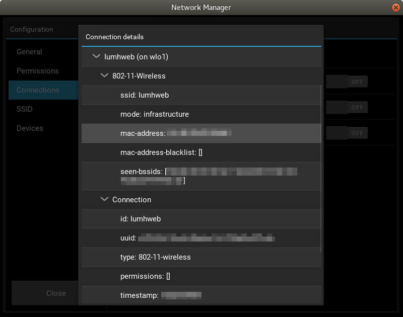

# KvNM

Simple network manager used for demonstration purposes.

## Getting Started
KvNM aims to provide useful and detailed information about your system
and network, however its current functionalities are very limited.

### Requirements
* Python 3.6+
* [Kivy](https://kivy.org/docs/gettingstarted/installation.html)
1.10.1 and Cython 2.25.2
* [PyGI](https://pygobject.readthedocs.io/) 3.26.1 provides bindings
for GObject.
* [GLib](https://developer.gnome.org/glib/) 2.46 and
[girepository](https://wiki.gnome.org/Projects/GObjectIntrospection)
for object publication support.

### Installation
Python dependencies:

`pip install -r requirements.txt`

## Authors

* **Fernando M** - https://github.com/gmork2

## License
This project is licensed under the GNU GENERAL PUBLIC LICENSE
Version 3 - see the [LICENSE](LICENSE) file for details.

